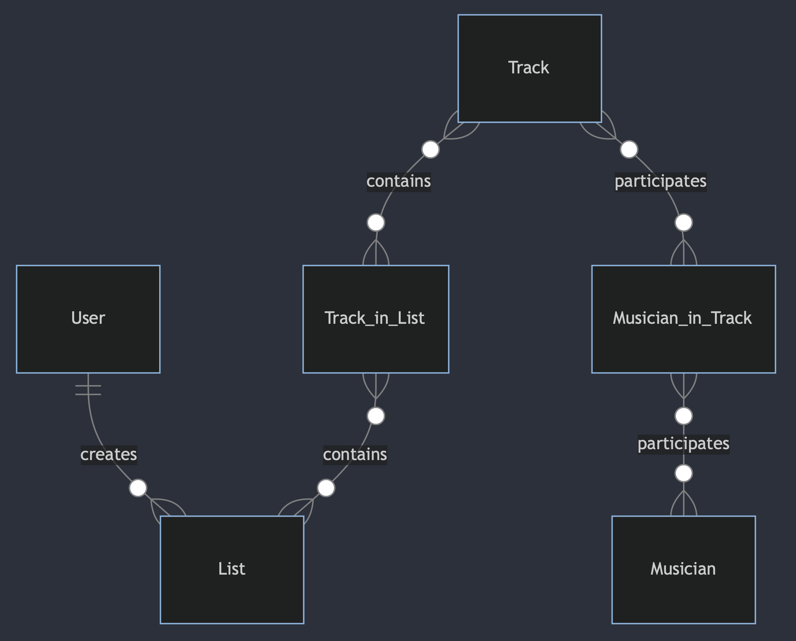

# Design Document

Swing Dance Repertoire
By Sopon Suwannakit

Video overview: https://youtu.be/59ZDIIGLz_I

## Scope

I had been performing music for swing dance communities in my area. I even took some dance lessons recently. Through these experiences, I feel the need for swing dance music database for jazz musicians and swing dance DJs to be able to easily create their playlists or setlists. The information in the tables in this database will contain musical information needed to create a well balanced swing dance music playlists or setlists. I hope this project will be helpful for swing dance community in Thailand and hopefully, it can be scaled up to support swing dance communities in the global scale.

* Tracks, including musical and chronological information of the tracks
* Users, including basic information of the DJs who create the playlists
* List, lists of tracks for a set or a dance session
* Include, specify which tracks are in which lists
* Musicians, this is for musicians participated in tracks
* Roles, tell the relationship between musicians and tracks either performing (with instruments or vocal indentified) or composing or arranging

## Functional Requirements

This database will allow the users to:

* Create their own playlists or setlists for a dance session
* See and analyze if the created list is well balanced with information such as tempos, keys, and composers
* It does not specify the style of the music, since it can be ambiguos sometimes.
* The key will be notated in flats only. This database does not use sharps.

## Representation

This will be written in SQLite3 with six tables in the database: "tracks", "users", "lists", "track_in_list", "musicians", and "musicians_in_track."

### Entities

The entities are in the following schema:

#### Tracks

The `tracks` table contains:

* `id`, the unique ID for each track as an `INTEGER`. This is will be the `PRIMARY KEY`.
* `title`, the title of the track as `TEXT` and `NOT NULL`.
* `tonality`, the tonality of the music as `TEXT`. This should be among the 12 pitches. It will need `CHECK("tonality" IN ("Gb", "B", "E", "A", "D", "G", "C", "F", "Bb", "Eb", "Ab", "Db")`. This can be `NULL` if the key quality is ambiguous.
* `key_quality`, the quality of the key as `TEXT`. This will be either major or minor, hence `CHECK("key_quality" IN ("major", "minor")`. This can be `NULL` if the key quality is ambiguous.
* `tempo`, the tempo in bpm as an `INTEGER` and `NOT NULL`.
* `band`, the band name as `TEXT` and `NOT NULL`.
* `year_released`, the releasing year of the track as an `INTEGER`.

#### Users

The `users` table contains:

* `id`, the unique ID for each user as an `INTEGER`. This is will be the `PRIMARY KEY`.
* `username`, the username of the user as `TEXT` and `UNIQUE`. The database will not contain sensitive personal information such as first name or last name.

All columns should be `NOT NULL`.

#### Lists

The `lists` table contains:

* `id`, the unique ID for each list as an `INTEGER`. This is will be the `PRIMARY KEY`.
* `list_name`, the name of the list as `TEXT` and `NOT NULL`.
* `user_id`, the ID of the user who created the list as an `INTEGER`. This is will be a `FOREIGN KEY` referencing the `id` column in the `users` table.

#### Track in List

The `track_in_list` table contains:

* `track_id`, the ID of a specific track as an `INTEGER`. This is will be a `FOREIGN KEY` referencing the `id` column in the `tracks` table.
* `list_id`, the ID of a specific list as an `INTEGER`. This is will be a `FOREIGN KEY` referencing the `id` column in the `lists` table.
* `order`, the order of the track within the list as an `INTEGER` and `NOT NULL`.

#### Musicians

The `musician` table contains:

* `id`, the unique ID for each musician as an `INTEGER`. This is will be the `PRIMARY KEY`.
* `first_name`, the first name of the musician as `TEXT` and `NOT NULL`.
* `last_name`, the first name of the musician as `TEXT` and `NOT NULL`.
* `birth_year`, the birth year of the musician as `INTEGER`.

#### Musician in Track

The `musician_in_track` table contains:

* `musician_id`, the ID of a specific musician as an `INTEGER`. This is will be a `FOREIGN KEY` referencing the `id` column in the `musicians` table.
* `track_id`, the ID of a specific track as an `INTEGER`. This is will be a `FOREIGN KEY` referencing the `id` column in the `tracks` table.
* `role`, the role of the musician participating in the track as `TEXT` and `NOT NULL`.

### Relationships

* User to List: One-to-Many (One user can create zero to multiple lists).
* List to Track_in_List: One-to-Many (One list can contain zero to multiple tracks).
* Track to Track_in_List: One-to-Many (One track can be in zero to multiple lists).
* Track to Musician_in_Track: One-to-Many (One track can have at least one to multiple musicians participating).
* Musician to Musician_in_Track: One-to-Many (One musician can participate in at least one to multiple tracks).

## Optimizations

* Since this database does not need overall data but individual or small picture data, it does not need any preset views.
* The database will need to search a lot of ids of tracks, ids of lists, and usernames. So there are three indexes to accomodate these needs.

## Limitations

* The database does not suppor albums. This is something it can evolve in the future used.
* If tracks or lists are updated frequently, this database will not allow to save the previous version of the list. Users will have to manually do that on the `list_name` like `Lindy ver1` and `Lindy ver2` and so on.
* The `roles` in `musician_in_track` left open ended and unchecked. It might led into a messy data collection. It is a trade-off I am willing to take since there might be some roles that I could not think of and somehow occurs. An easy way to fix is to list some and include `other` but I would rather see what will be in that column before make some preset values.
